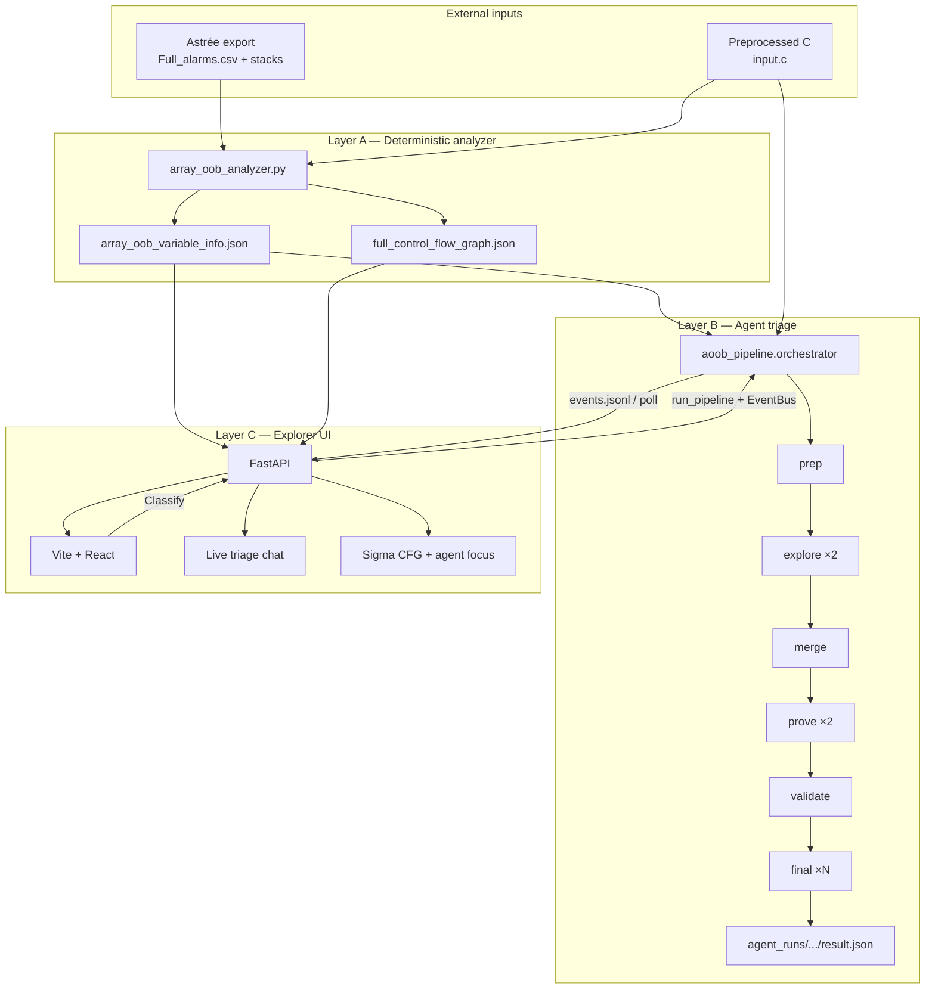
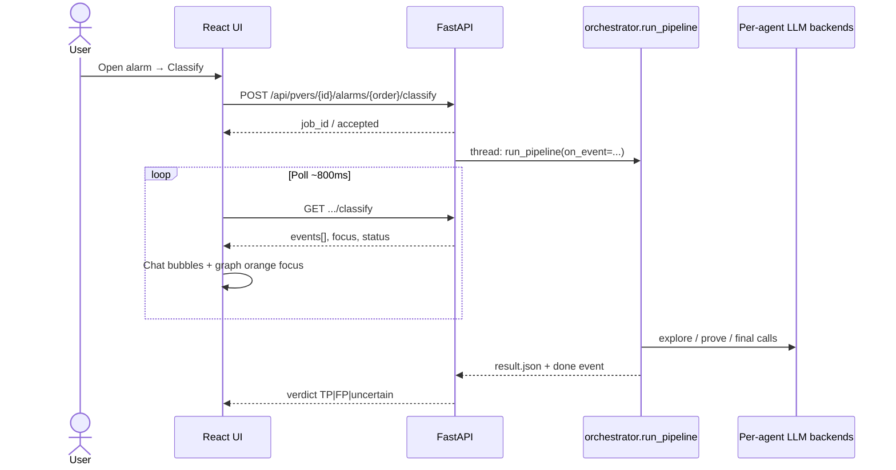
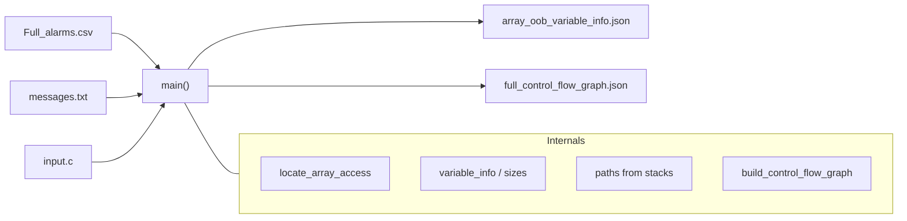
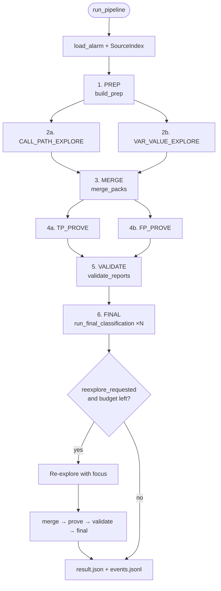
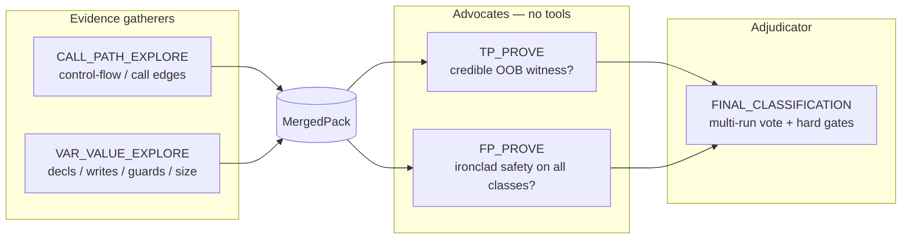
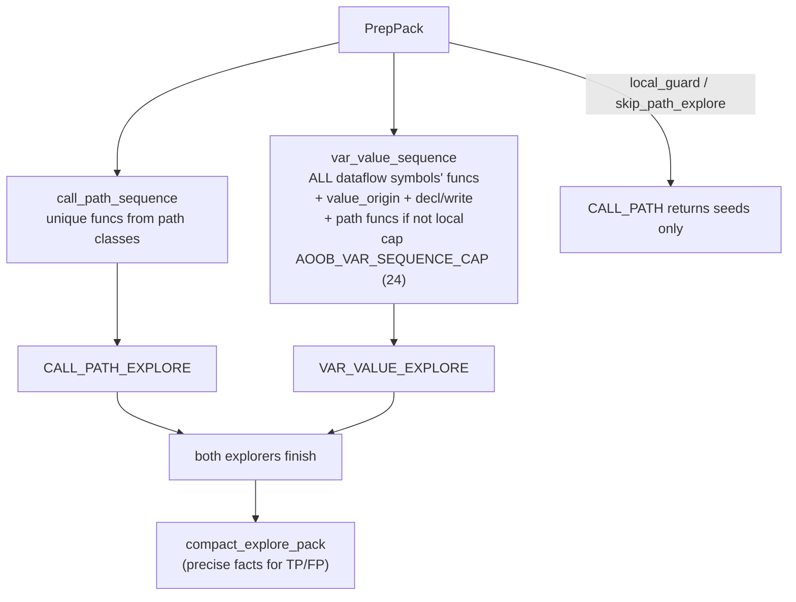
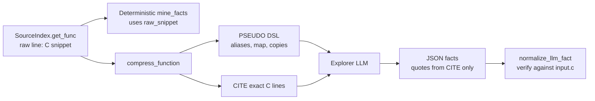
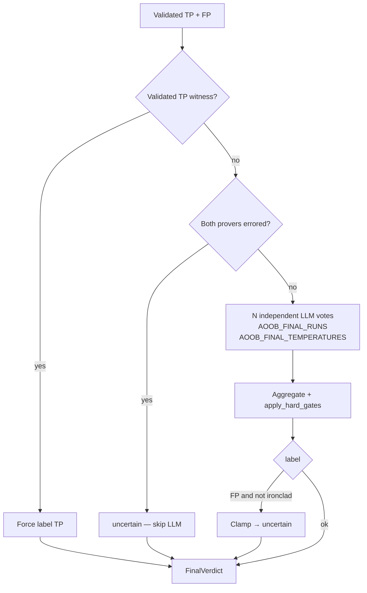
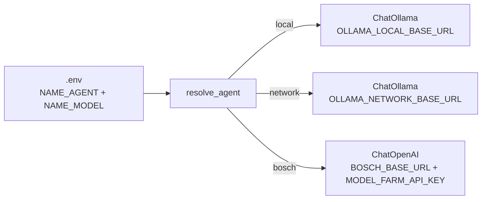

# AOOB Implementation Guide

Complete technical description of what is implemented in this repository: Astrée array-out-of-bounds enrichment, interactive CFG exploration, and multi-agent TP/FP triage.

This document is the deep companion to `README.md` (quick start / ops). Secrets belong in local `.env` only — never commit API keys.

---

## Table of contents

1. [Purpose and product goals](#1-purpose-and-product-goals)
2. [System architecture (overview)](#2-system-architecture-overview)
3. [Repository layout](#3-repository-layout)
4. [PVER data contract](#4-pver-data-contract)
5. [Analyzer layer](#5-analyzer-layer)
6. [Agent triage pipeline](#6-agent-triage-pipeline)
7. [Explore subsystem in depth](#7-explore-subsystem-in-depth)
8. [Prove, validate, final, policy](#8-prove-validate-final-policy)
9. [Data contracts (schemas)](#9-data-contracts-schemas)
10. [Run artifacts](#10-run-artifacts)
11. [LLM backends and configuration](#11-llm-backends-and-configuration)
12. [UI architecture](#12-ui-architecture)
13. [Event bus and live triage](#13-event-bus-and-live-triage)
14. [Tests](#14-tests)
15. [Feature inventory (implemented)](#15-feature-inventory-implemented)
16. [Typical workflows](#16-typical-workflows)

---

## 1. Purpose and product goals

Astrée emits many array-OOB alarms; far fewer are real bugs. This project:

1. **Enriches** each alarm with symbols, sizes, occurrences, and call paths (deterministic analyzer).
2. **Visualizes** the full PVER control-flow graph and per-alarm path highlights (UI).
3. **Classifies** one alarm as **TP**, **FP**, or **uncertain** with quoted evidence and an ironclad-FP / never-miss-TP policy (agent pipeline).

Hard product rules:

| Rule | Meaning |
|------|---------|
| Wrong FP is worst | Auto-close as FP only when the safety case is ironclad |
| Prefer uncertain | Thin evidence → human review, not FP |
| Prefer TP when witnessed | Validated OOB witness blocks FP |
| Quotes must be real | Findings verified against `input.c` |

---

## 2. System architecture (overview)

### 2.1 Three-layer system



### 2.2 End-to-end classify flow



---

## 3. Repository layout

```text
AOOB-9-9/
├── array_oob_analyzer.py          # CLI: symbols + CFG (no LLM)
├── aoob_pipeline/                 # LangGraph multi-agent triage
│   ├── __main__.py                # python -m aoob_pipeline
│   ├── orchestrator.py            # stage wiring + parallelism + reexplore
│   ├── prep.py                    # skeletons, path classes, size recovery
│   ├── source_index.py            # function spans, get_func, quote verify
│   ├── explore_graph.py           # CALL_PATH + VAR_VALUE explorers
│   ├── explore_support.py         # sequences, seeds, body mining
│   ├── pseudocode.py              # C → PSEUDO+CITE for LLM context
│   ├── tools.py / session.py      # visit cursor + LangChain tools
│   ├── merge.py / validate.py     # packs + evidence scrub
│   ├── prove_graph.py             # TP_PROVE + FP_PROVE
│   ├── final_graph.py             # multi-run adjudicator
│   ├── policy.py                  # ironclad FP / never-miss TP
│   ├── events.py / artifacts.py   # live stream + run folders
│   ├── schemas.py / prompts.py    # Pydantic packs + system prompts
│   ├── config.py / llm.py         # .env backends + ChatOllama/OpenAI
│   └── tests/                     # unit tests (no live LLM required)
├── UI/
│   ├── src/                       # React explorer
│   └── backend/app/main.py        # FastAPI (browse + classify)
├── PVERs/<id>/                    # one analysis unit per folder
├── requirements-agent.txt
├── README.md                      # ops / quick start
└── IMPLEMENTATION.md              # this file
```

---

## 4. PVER data contract

Each `PVERs/<id>/` folder is a self-contained analysis unit:

| File | Producer | Consumer | Role |
|------|----------|----------|------|
| `Full_alarms.csv` | Astrée | UI, prep Order join | `Order`, `Location`, message |
| `input.c` | Build / Astrée preprocess | Analyzer, pipeline, UI | Same line numbers as Astrée |
| `messeges.txt` / `messages.txt` | Astrée (optional) | Analyzer `--merge-paths` | Full stacks per location |
| `array_oob_variable_info.json` | Analyzer | UI + pipeline | Alarms, symbols, paths |
| `full_control_flow_graph.json` | Analyzer | UI FullGraph | `{ caller: [callees…] }` |
| `agent_runs/<order>/<UTC>/` | Pipeline | UI / humans | Triage evidence trail |

**Lookup rule:** UI and pipeline resolve Astrée **Order** (e.g. `2,475`) via CSV `Location` join when JSON uses `group_id`. Do not assume `order == group_id`.

---

## 5. Analyzer layer

**Module:** `array_oob_analyzer.py` (no LLM).



**What it produces per alarm group:**

- Flagged array / index / parent symbols (not every identifier on the line)
- Kind, scope, dims/size when known, declaration, access counts
- Occurrences with line, function, access mode
- `paths[]` when message log available (`no_of_paths`, `no_of_traces`)
- Closed caller→callee CFG for defined functions

**Modes:**

```powershell
# full enrich + CFG into the paths you pass
python array_oob_analyzer.py <alarms.csv|messages.txt> <input.c> <array_oob_variable_info.json> [cfg.json]

# CFG only
python array_oob_analyzer.py --cfg-only <input.c> <full_control_flow_graph.json>

# attach / refresh Astrée stacks into existing variable-info JSON
python array_oob_analyzer.py --merge-paths <array_oob_variable_info.json> [messages.txt]
```

Agents **re-check** quotes against `input.c` and can recover array size from initializer lists when the analyzer left `name[] = { … }` without an explicit dimension.

---

## 6. Agent triage pipeline

**Entry:** `python -m aoob_pipeline --pver 4105 --order 2475`  
**Core:** `aoob_pipeline.orchestrator.run_pipeline`

### 6.1 Stage graph



Explore and prove fan-out use `ThreadPoolExecutor(max_workers=2)` unless `--sequential` / UI sequential mode.

### 6.2 Stage responsibilities

| # | Stage | Module | LLM? | Tools? | Output file |
|---|-------|--------|------|--------|-------------|
| 1 | Prep | `prep.py` | No | No | `01_prep.json` |
| 2 | Explore | `explore_graph.py` | Yes (extract / tools) | Optional | `02_*_explore.json` |
| 3 | Merge | `merge.py` | No | No | `03_merged.json` |
| 4 | Prove | `prove_graph.py` | Yes | No | `04_tp_prove.json`, `04_fp_prove.json` |
| 5 | Validate | `validate.py` | No | No | `05_validated.json` |
| 6 | Final | `final_graph.py` | Yes ×N | No | `06_final_vote.json` |

### 6.3 Prep details (`prep.build_prep`)

Deterministic skeleton for the alarm:

- Resolve alarm by Order / Location / group_id
- Parse location → alarm line + enclosing function
- Clean index expression (Astrée paren slices)
- Build `raw_paths` → collapse into **path classes**
  - Exact sequence classes (`C1`, `C2`, …)
  - If over `AOOB_PATH_CLASS_CAP` (default 15): cluster by last-3 suffix → `K*` and mark `coverage_cap=partial`
  - Exception: when `index_origin=local`, coverage may stay `full` (callers cannot change the index)
- Symbol skeletons (array + index); **re-point / synthesize** index decls when analyzer missed them
- **Array size recovery** from initializer element count for `T name[] = { … }`
- Local guard scan in alarm function
- `index_origin` ∈ `parameter | local | global | unknown`
- `value_origin_callees` — functions on RHS of index assignments
- Edges for UI focus overlay

### 6.4 Five agents



Each agent has independent `{NAME}_AGENT` / `{NAME}_MODEL` in `.env` (`local` | `network` | `bosch`).

---

## 7. Explore subsystem in depth

### 7.1 Modes (`AOOB_EXPLORE_MODE`)

| Mode | Behavior | When |
|------|----------|------|
| **`code_driven`** (default) | Python opens every sequence function; mines quotes; LLM returns JSON facts only | Small models (e.g. 7B) that fail tool calling |
| **`tool_agent`** | LLM must call `get_current` / `move_func` / `submit_explore_pack` | Strong tool-calling models |
| Fallback | If tool agent never submits → **automatically runs code_driven** | Resilience |

### 7.2 Visit sequences



VAR_VALUE brief includes **every** `prep.symbols[]` entry (declarations + writes tagged by `symbol`) and `symbol_paths` for UI dataflow highlighting. Merge/prove never starts until **both** explore packs exist.
### 7.3 Visit cursor + tools (`session.py`, `tools.py`)

`ExploreCursor` tracks `sequence`, `index`, `opened`.  
`submit_explore_pack` is **rejected** until `remaining == []` and facts are non-empty.

| Tool | Purpose |
|------|---------|
| `visit_status` | Current index, opened set, remaining |
| `move_func` | `next` / `prev` / absolute `step` (no source) |
| `get_current` | PSEUDO+CITE for current function; marks visited |
| `get_func` | Named function PSEUDO+CITE; marks if in sequence |
| `get_lines` | Raw C window (max 400 lines) |
| `submit_explore_pack` | Accept facts_json after full visit |

### 7.4 Pseudocode compression (`pseudocode.py`)

**Knob:** `AOOB_PSEUDOCODE=1` (default on).

Before the LLM sees a body:



Compression features:

- Strip Astrée boolean noise `(0 != 0)` / `(1 != 0)`, trivial casts
- Preferred aliases (`imsData→d`, `B_newDatRx→RX`, …)
- For-loop buffer copies → `dest=src[N]`
- Switch of simple assigns → `cmd=map(state){0x41:0x81,…,else:idle(&d)}`
- Collapse `EMS0…EMS6` assigns → `EMS[0..6]=…`
- Keep `@line` anchors for orientation; **CITE** carries verifiable quotes

### 7.5 Seeds and mining (`explore_support.py`)

Always seeded (verified):

- Array / index declarations
- Initializer `array_size_hint` when count recovered
- Alarm-site line
- Local guard hit when found

Deterministic mining from each body: accesses, writes, guards, call edges, size hints.

`normalize_llm_fact` drops irrelevant / unverifiable LLM rows (quote ±2 lines, kind sanitization, relevance tokens).

---

## 8. Prove, validate, final, policy

### 8.1 Prove (`prove_graph.py`)

- Input: compact **MergedPack** brief (`build_brief` / `compact_facts`, capped by `AOOB_PROVER_BRIEF_MAX_CHARS`)
- No tools — reasoning over quoted facts only
- Output: `ProveReport` with `claim`, `index_range`, `array_size`, `witness`, `coverage`, findings, addressed/unaddressed classes
- Dynamic Ollama `num_ctx` growth so long briefs do not truncate the system prompt (`llm.ctx_for_prompt`)

### 8.2 Validate (`validate.py`)

- Drop findings whose quotes fail `SourceIndex.verify_quote`
- Soft FP (claim=fp but incomplete) → rewrite toward `no_credible_case`
- Clear TP witness without findings
- Local `index_origin` can treat one bound as addressing all path classes

### 8.3 Final (`final_graph.py`)



FP requires **unanimous** ironclad votes. Reexplore is allowed only under uncertain with a focused missing bound/size request (not to shop for FP).

### 8.4 Ironclad FP checklist (`policy.fp_is_ironclad`)

All must hold:

1. No validated TP witness
2. FP `claim=fp`, `coverage=full`
3. No `unaddressed_path_classes`, no agent error
4. `index_range` not `unknown`; `array_size=known`
5. `witness != found`; non-empty findings; empty `missing_evidence`
6. Merged coverage not partial due to path-class cap (unless local-index exception)
7. Every path class addressed
8. Bound-related facts present unless index is constant

`prefer_label_after_gates` clamps illegal FP → uncertain and prefers TP when witnessed.

---

## 9. Data contracts (schemas)

Defined in `aoob_pipeline/schemas.py` (Pydantic):

| Model | Role |
|-------|------|
| `PrepPack` | Alarm skeleton: paths, classes, symbols, guards, origins, coverage_cap |
| `Fact` | `{kind, function, line, quote, symbol?, path_class_id?, verified?}` |
| `ExplorePack` | Agent facts + notes + optional tool_trace |
| `MergedPack` | prep + both explores + `facts_by_class` + coverage |
| `ProveReport` | TP/FP claim fields |
| `ValidatedReports` | Scrubbed TP/FP + dropped list |
| `FinalVerdict` | `label`, rationale, votes, reexplore_* |
| `PipelineResult` | pver_id, order, run_dir, verdict |

**Fact kinds (examples):**  
`declaration`, `alarm_site`, `access`, `write`, `guard`, `clamp`, `mask`, `loop_bound`, `arg_binding`, `call_edge`, `path_step`, `array_size_hint`, `local_guard`, …

---

## 10. Run artifacts

Each classify writes:

```text
PVERs/<id>/agent_runs/<safe_order>/<YYYYMMDDTHHMMSSZ>/
  01_prep.json
  02_call_path_explore.json
  02_var_value_explore.json
  03_merged.json
  04_tp_prove.json
  04_fp_prove.json
  05_validated.json
  06_final_vote.json
  result.json
  events.jsonl
  # if re-explore:
  07_reexplore_*.json … 11_final.json
```

`safe_order` turns Astrée `2,475` into `2_475`.

---

## 11. LLM backends and configuration

### 11.1 Backend resolution (`config.resolve_agent`, `llm.build_agent_llm`)



### 11.2 Pipeline knobs

| Variable | Default | Meaning |
|----------|---------|---------|
| `AOOB_PATH_CLASS_CAP` | `15` | Max path classes after collapse |
| `AOOB_FINAL_RUNS` | `3` | Independent final votes |
| `AOOB_FINAL_TEMPERATURES` | `0.0,0.3,0.6` | Vote diversity |
| `AOOB_MAX_TOOL_ROUNDS` | `12` | Tool-agent loop budget |
| `AOOB_MAX_REEXPLORE` | `1` | Bounded re-explore passes |
| `AOOB_EXPLORE_MODE` | `code_driven` | Explore strategy |
| `AOOB_PSEUDOCODE` | `1` | PSEUDO+CITE compression |
| `AOOB_PROVER_BRIEF_MAX_CHARS` | `60000` | Prove brief trim |
| `AOOB_TP_POLICY` | `type_legal` | Witness policy note |
| `AOOB_OLLAMA_RUNTIME_FALLBACK` | `1` | Fallback when Ollama agent fails |
| `AOOB_MAX_NUM_CTX` | `32768` | Cap for dynamic ctx growth |
| `OLLAMA_NUM_CTX` | `8192` | Base Ollama context |

Illustrative agent wiring (use models you actually serve):

```env
CALL_PATH_EXPLORE_AGENT=local
CALL_PATH_EXPLORE_MODEL=qwen2.5-coder:7b
VAR_VALUE_EXPLORE_AGENT=local
VAR_VALUE_EXPLORE_MODEL=qwen2.5-coder:7b
TP_PROVE_AGENT=network
TP_PROVE_MODEL=qwen3:14b
FP_PROVE_AGENT=network
FP_PROVE_MODEL=qwen3:14b
FINAL_CLASSIFICATION_AGENT=network
FINAL_CLASSIFICATION_MODEL=gemma4:26b
AOOB_EXPLORE_MODE=code_driven
AOOB_PSEUDOCODE=1
```

---

## 12. UI architecture

### 12.1 Components

| Piece | Path | Role |
|-------|------|------|
| Frontend | `UI/src/App.tsx` | PVER picker, alarm/PVER modes, agent chat, classify |
| Graph | `UI/src/FullGraph.tsx` | Sigma CFG; orange **agent focus** overlay |
| Ordering | `UI/src/cfgOrder.ts` | declaration → callers → leaf |
| Paths | `UI/src/paths.ts` | unique path sequences / filters |
| Backend | `UI/backend/app/main.py` | Browse APIs + classify job runner |
| Proxy | Vite `/api` → `127.0.0.1:8000` | Dev convenience |

### 12.2 UI modes

| Mode | Content |
|------|---------|
| **Single alarm** | Header; control-flow (unique Astrée paths); data-flow (variables / CFG-ordered functions) |
| **Single PVER** | Full CFG from JSON; path highlight from searched alarm; right-hand variable/function list |

Shared chrome: PVER picker, mode toggle, Order search, left **agent chat**, orange **agent focus** on the graph during Classify.

### 12.3 Main APIs

| Method | Path | Purpose |
|--------|------|---------|
| GET | `/api/pvers` | List PVER folders |
| POST | `/api/pvers/{id}/open` | Activate; may spawn analyzer |
| GET | `/api/pvers/{id}/status` | Analyzer job poll |
| GET | `/api/alarms`, `/api/alarm/{order}` | Alarm list / detail + `graph_highlight` |
| GET | `/api/graph`, `/api/cfg*` | CFG layout / search / neighborhood |
| POST | `/api/pvers/{id}/alarms/{order}/classify` | Start `run_pipeline` |
| GET | `…/classify` | Status + streamed events + result |
| GET | `/api/health` | Liveness |

Classify uses **POST then poll** (not SSE). UI polls ~800ms and appends new events.

---

## 13. Event bus and live triage

`events.EventBus` writes `events.jsonl` and invokes `on_event` for the UI job.

| Kind | Typical use |
|------|-------------|
| `stage` | Prep / merge / validate banners |
| `agent_input` | Case brief / merged pack preview |
| `agent_thinking` | Reasoning / extract steps |
| `tool_result` | get_func / pseudocode / opened bodies |
| `agent_output` | Explore packs / prove reports / votes |
| `agent_error` | Backend failures |
| `done` | Final verdict |

Events may carry `functions` / `edges` plus:

| Field | Purpose |
|-------|---------|
| `cursor` (per agent in focus.`cursors`) | Live CALL_PATH / VAR_VALUE marker (`current`, `index`/`total`, `symbols`) |
| `call_path` | Full call sequence + thick edge list for FullGraph |
| `var_paths` | Per-symbol dataflow function chains (softer highlight) |

FullGraph keeps a **stable full-graph camera** (no auto-zoom on agent moves). Separate chips/markers track each explorer; call-path edges are thicker than var/dataflow edges.
---

## 14. Tests

No live LLM required for unit tests.

```powershell
# Agent pipeline
python -m pytest aoob_pipeline/tests -q

# UI API
cd UI/backend
python -m pytest tests/test_api.py -q
```

| Test module | Coverage |
|-------------|----------|
| `test_policy.py` | Weak FP not ironclad; clamp FP; TP blocks FP |
| `test_explore_visit.py` | Visit gate; seeds/sequences |
| `test_pseudocode.py` | Compression shrink; raw preserved; parse |
| `test_prep_validate.py` | Fixture prep + validate |
| `test_prep_fixes.py` | Index clean/re-point; local origin vs cap; mining; merge; ctx growth |
| `UI/backend/tests/test_api.py` | Alarms, CFG, graph highlight, PVER open isolation |

---

## 15. Feature inventory (implemented)

| Feature | Where | Status |
|---------|-------|--------|
| Astrée alarm → symbol/path enrich | `array_oob_analyzer.py` | Done |
| Closed CFG JSON | analyzer `--cfg-only` / full run | Done |
| Message-log path merge | `--merge-paths` | Done |
| Path-class collapse + cap | `prep._collapse_path_classes` | Done |
| Initializer array-size recovery | `prep` / `explore_support` | Done |
| Index origin + value-origin callees | `prep` | Done |
| Index symbol re-point / synthesize | `prep._fix_index_symbols` | Done |
| Local guard short-circuit | `prep` + explore | Done |
| code_driven explore (default) | `explore_graph` | Done |
| tool_agent explore + fallback | `explore_graph` | Done |
| Visit-all cursor + submit gate | `session` / `tools` | Done |
| PSEUDO+CITE compression | `pseudocode.py` | Done |
| Deterministic seeds + body mining | `explore_support` | Done |
| Quote verification | `source_index` / merge / validate | Done |
| Parallel explore/prove | `orchestrator` | Done |
| Multi-symbol VAR_VALUE + both-before-merge | `explore_support` / `orchestrator` | Done |
| Compact explore packs for prover brief | `explore_support.compact_explore_pack` | Done |
| Dual explorer cursors + path weights (no auto-zoom) | `events` + `FullGraph.tsx` | Done |
| Ironclad FP policy | `policy` / `final_graph` | Done |
| Multi-run final + temp diversity | `final_graph` | Done |
| Bounded re-explore | `orchestrator` | Done |
| Live EventBus + UI chat/focus | `events` + UI | Done |
| Per-agent local/network/bosch | `config` / `llm` | Done |
| Dynamic Ollama num_ctx | `llm.ctx_for_prompt` | Done |
| Prover brief compaction | `prove_graph` | Done |
| Order via Location join | prep + UI `AlarmStore` | Done |

---

## 16. Typical workflows

### 16.1 New PVER

1. Drop Astrée CSV + `input.c` (+ optional `messages.txt`) into `PVERs/<id>/`.
2. Run analyzer (or open PVER in UI and let backend build).
3. Browse in **Single PVER** or **Single alarm**.
4. Configure `.env` agent backends; start FastAPI + Vite.
5. **Classify** → inspect chat + `agent_runs/.../result.json`.

### 16.2 CLI-only classify

```powershell
python -m pip install -r requirements-agent.txt
python -m aoob_pipeline --pver 4105 --order 2475
# or Astrée Order string:
python -m aoob_pipeline --pver 4105 --order "2,475"
# lower VRAM:
python -m aoob_pipeline --pver 4105 --order 2475 --sequential
```

### 16.3 Evidence review checklist

1. `01_prep.json` — path classes, `array_size`, `index_origin`, local_guard  
2. Explore packs — seeded + mined + LLM facts  
3. `03_merged.json` — coverage full/partial  
4. Prove reports — claim / witness / unaddressed classes  
5. `05_validated.json` — dropped uncited findings  
6. `06_final_vote.json` / `result.json` — label + rationale + votes  

---

## Appendix A — Module responsibility map

| Module | Responsibility |
|--------|----------------|
| `orchestrator.py` | Stage wiring, parallelism, reexplore, artifacts |
| `prep.py` | Alarm load, path classes, symbols, guards, origins, size recovery |
| `source_index.py` | Line/function spans over `input.c`, quote verify |
| `explore_graph.py` | LangGraph + code-driven explorers |
| `explore_support.py` | Sequences, seeds, mining, LLM fact normalize |
| `pseudocode.py` | C → PSEUDO+CITE |
| `session.py` / `tools.py` | Visit cursor + tools |
| `merge.py` | Attach facts to classes; verify quotes |
| `prove_graph.py` | TP/FP advocates |
| `validate.py` | Drop uncited / soft claims |
| `final_graph.py` | Multi-run adjudicator + hard gates |
| `policy.py` | Ironclad FP / never-miss TP |
| `events.py` / `artifacts.py` | Stream + run folders |
| `config.py` / `llm.py` / `prompts.py` | Env, models, prompts |
| `schemas.py` | Cross-stage Pydantic packs |

---

## Appendix B — Related docs

| Doc | Audience |
|-----|----------|
| `README.md` | Operators: setup, knobs, quick architecture |
| `UI/README.md` | Frontend/backend run notes |
| `IMPLEMENTATION.md` | This file: full implemented design |

---

*Generated from the current codebase. When behavior changes, update this file alongside `README.md`.*
